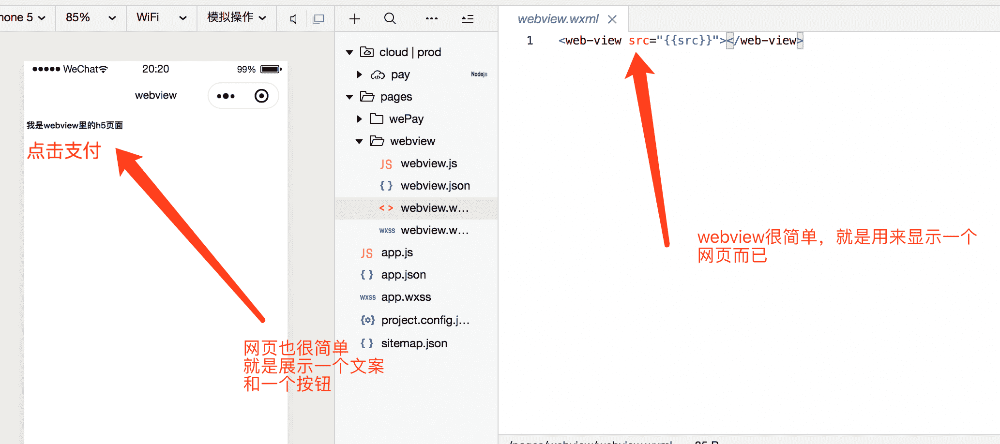
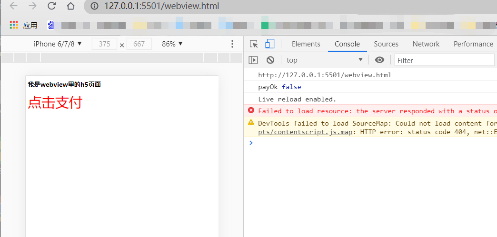
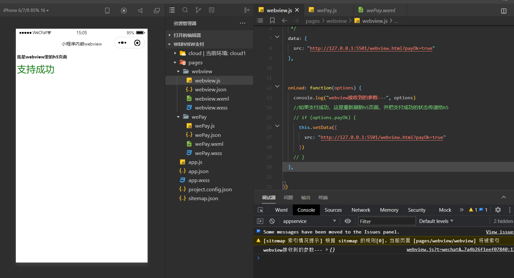

# 微信小程序webview组件交互,内联h5页面并网页实现微信支付

# 1·定义webview显示h5页面
[官方文档](https://developers.weixin.qq.com/miniprogram/dev/component/web-view.html)

# 2·定义h5页面 - (webview-wx.html仅支持微信,webview-more.html 支持多平台小程序)
+ 启动一个本地服务器，用来展示一个简单的h5页面。

上图是我在浏览器里显示的效果。
接下来我们在小程序的webview里显示这个页面，也很简单，只需要把我们的src定义为我们的本地网页链接就可以了。

